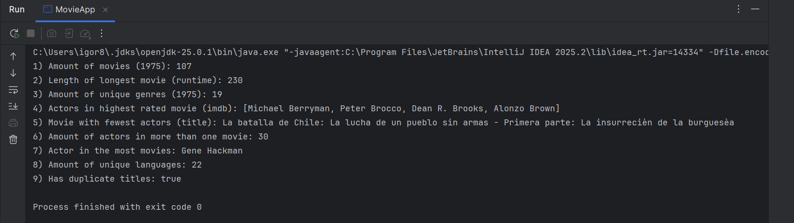

# Movie Queries

Detta projekt demonstrerar funktionell programmering i Java genom att
ansluta till en molnbaserad MongoDB-databas (MongoDB Atlas),
hämta filmdata och bearbeta den med hjälp av Streams och Lambdas.

Applikationen är byggd som en konsolapplikation.

---

## Tekniker

- Java
- Maven (build & dependency management)
- MongoDB Atlas
- MongoDB Java Driver
- Dotenv (miljövariabler)
- SLF4J (logging)

---

## Projektstruktur

Projektet är uppdelat enligt följande ansvarsfördelning:

- **MovieApp** – Applikationens entry point och konsolbaserad presentation
- **MovieRepository** – Repository-lager (databasåtkomst)
- **MovieQueries** – Funktionell logik (Streams & Lambdas)
- **Movie** – Domänmodell (immutable objekt)

---

## Funktionalitet

Programmet hämtar filmer från år 1975 från MongoDB Atlas
(sample_mflix.movies) och beräknar följande:

1. Antal filmer från 1975
2. Längden på den längsta filmen
3. Antal unika genrer
4. Skådespelare i filmen med högst IMDB-rating
5. Titel på filmen med minst antal skådespelare
6. Antal skådespelare som medverkat i mer än en film
7. Skådespelaren som medverkat i flest filmer
8. Antal unika språk
9. Om det finns dubblettitlar

Alla beräkningar görs med Java Stream API.

---

## Konfiguration

### Miljövariabler (Dotenv)

Känsliga uppgifter, såsom MongoDB URI och inloggningsuppgifter,
hanteras via lokala miljövariabler i en `.env`-fil och är inte inkluderade i repositoryt.

> En mall för lokala inställningar finns i filen `.env.example`.

### Loggning (SLF4J)

Projektet använder SLF4J för logghantering.
För att undvika onödiga loggutskrifter från MongoDB-drivern konfigureras
loggnivån via en `simplelogger.properties`-fil i `src/main/resources`,
där standardnivån är satt till `off`.

> Detta säkerställer en ren och fokuserad konsolutskrift vid körning.

---

<h2 align="center">Exekvering av applikationen</h2>

  
   
  <em>Exempel på konsolutskrift när applikationen körs och beräknar resultaten.</em>

